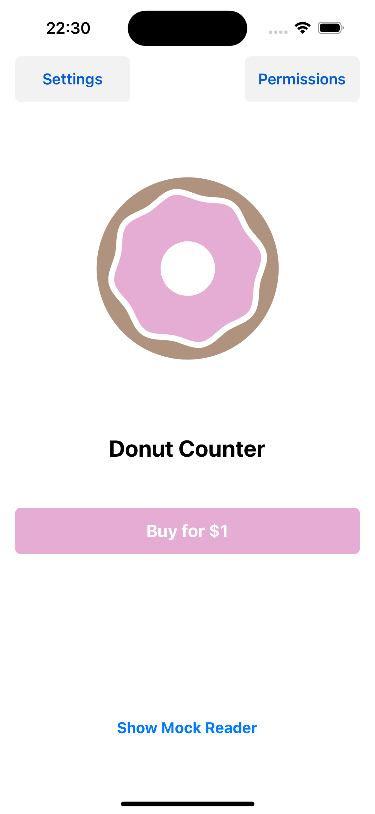
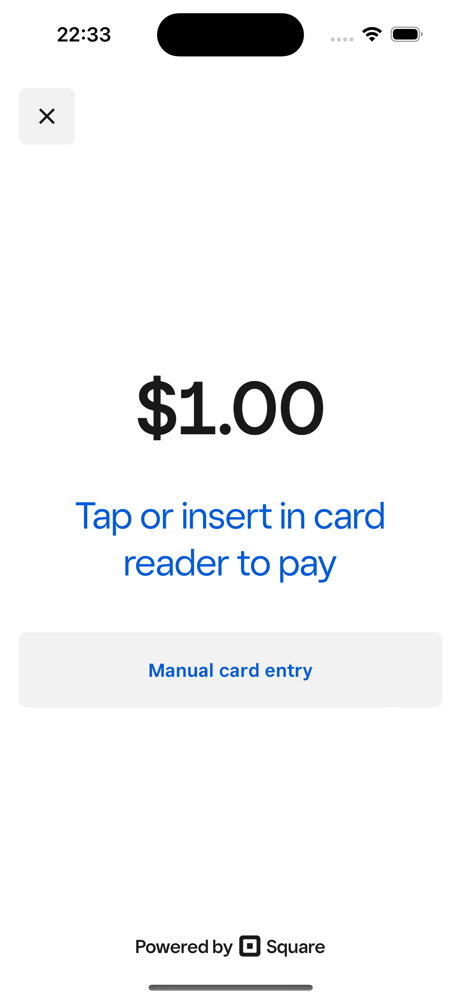

# React Native plug-in for Mobile Payments SDK

[](https://badge.fury.io/js/mobile-payments-sdk-react-native)

Mobile Payments SDK for React Native supports the following SDK versions:

  * [iOS](https://developer.squareup.com/docs/mobile-payments-sdk/ios#1-install-the-sdk-and-dependencies): 2.2.3 and above
  * [Android](https://developer.squareup.com/docs/mobile-payments-sdk/android#1-install-the-sdk-and-dependencies): 2.3.0 and above

## Review requirements
Before getting started, please review the Requirements and Limitations and Device Compatibility sections to ensure that the SDK can be used in your project:
* Android: [Requirements and Limitations](https://developer.squareup.com/docs/mobile-payments-sdk/android#requirements-and-limitations), [Device Compatibility](https://developer.squareup.com/docs/mobile-payments-sdk/android#device-permissions)
* iOS: [Requirements and Limitations](https://developer.squareup.com/docs/mobile-payments-sdk/ios#requirements-and-limitations), [Device Compatibility](https://developer.squareup.com/docs/mobile-payments-sdk/ios#device-permissions)

## Installation
```sh
npm install mobile-payments-sdk-react-native
or
yarn add mobile-payments-sdk-react-native
```

For usage and in-detail documentation, visit our [documentation](docs/) section.

## Documentation
* [Mobile Payments SDK Overview](https://developer.squareup.com/docs/mobile-payments-sdk)
* [iOS Tech Reference](https://developer.squareup.com/docs/sdk/mobile-payments/ios)
* [Android Tech Reference](https://developer.squareup.com/docs/sdk/mobile-payments/android)

If you need more assistance, contact [Developer and App Marketplace Support](https://squareup.com/help/us/en/contact?panel=BF53A9C8EF68) or ask for help in the [Developer Forums](https://developer.squareup.com/forums/).

## Mobile Payments SDK Sample App
 

[Donut Counter](example/) is a sample application included in the `example` folder of this repository. It is built using React Native 0.75 and designed to help developers utilize the Square Mobile Payments SDK. This application serves as a practical guide for integrating and leveraging the SDK's capabilities within your own projects. It demonstrates essential functions such as initializing and authorizing the SDK, using mock readers, and processing a $1.00 payment.

## License

```
Copyright 2025 Square Inc.

Licensed under the Apache License, Version 2.0 (the "License");
you may not use this file except in compliance with the License.
You may obtain a copy of the License at

    http://www.apache.org/licenses/LICENSE-2.0

Unless required by applicable law or agreed to in writing, software
distributed under the License is distributed on an "AS IS" BASIS,
WITHOUT WARRANTIES OR CONDITIONS OF ANY KIND, either express or implied.
See the License for the specific language governing permissions and
limitations under the License.
```

## Contributing

See the [contributing guide](CONTRIBUTING.md) to learn how to contribute to the repository and the development workflow.
